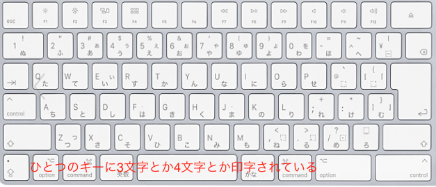
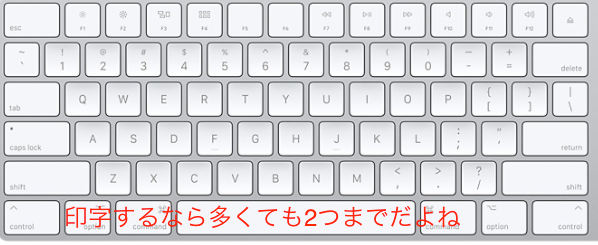
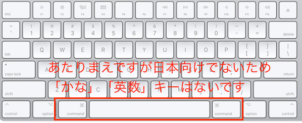

# USキーボードの魅力

晴佐久 哲士

---

突然ですが、お手元を確認してみてください

---

当然、プログラマなのであれば

---

---

ですよねぇ

---

でも、極稀に

---

---

な人もいるので、今日はそんな人向けにUSキーボードの魅力を語っていこうと思います

---

## 魅力1. 意味のあるキー配列

---

JISキーボードのキー配列には突っ込みどころがたくさんあります

---

---

---

---

---

一方、US配列だと

---

---

---

---

といったように配置が合理的です

---

## 魅力2. ホームポジションが意識されたキー配置

---

JISキーボードをお使いの方は、ホームポジションに手を添えてみてください

---

---

---

ん？

---

---

---

JISキーボードだと、センターがやや左寄りになっています

---

USキーボードだと、センターに合わせてあるため、よく使うreturnキーまで小指が届き、いちいちホームポジションから指を離さないで作業ができます

---

## 魅力3. 合理的なキーサイズ

---

JIS配列の突っ込みどころはまだまだあります

---

---

なんで、こんなにキーの大きさバラバラなの・・・

---

Delキーなんてよくつかうじゃん！

---

一方のUSキーボードだと

---

---

必要なキーが必要な大きさになっています

---

こっちのほうが無駄がなくていいですね

---

## 魅力4. 印字の美しさ

---

---



---

なんと、4つも魅力があった

---

じゃあ、逆にJISが会う人ってどんな人なんでしょう

---

## USキーのデメリット

---

「かな」、「英数」の切り替えキーがない

---



---

「かな」「英数」で切り替えている人はそのままだとできないので注意が必要です

---

他、ローマ字ではなくかな入力で日本語を入力している人は印字されてないので使いにくいです

---

こういった点があまり関係ない人なのであれば、USキーボードは十分選択肢に入るのではないでしょうか

---

## 最後に

---

キーボードを含めたHuman Interfaceデバイスはコンピュータを操作する入り口部分です。
そのため、意外にも重要な部分なのではないかと個人的には思ってます。

いままで気にしたことがない人は、ちょっとでも気をかけてみてはいかがでしょうか

---

## 宣伝

---

USキーボード、安く買えるみたいです

[ Ankerウルトラスリム ￥1,899 ](https://www.amazon.co.jp/Anker-%E3%82%A6%E3%83%AB%E3%83%88%E3%83%A9%E3%82%B9%E3%83%AA%E3%83%A0-Bluetooth-%E3%83%AF%E3%82%A4%E3%83%A4%E3%83%AC%E3%82%B9%E3%82%AD%E3%83%BC%E3%83%9C%E3%83%BC%E3%83%89-Android/dp/B00U260UR0)

[ LEOBOG K23 ￥2,499 ](https://www.amazon.co.jp/gp/product/B0713MVLGC/ref=oh_aui_detailpage_o00_s00?ie=UTF8&psc=1)

---

おわり

