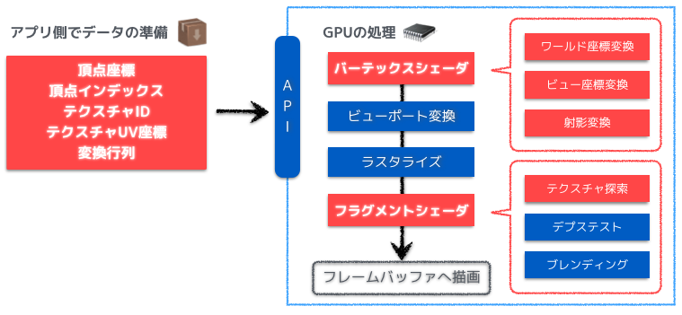
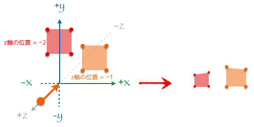
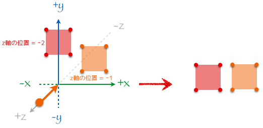
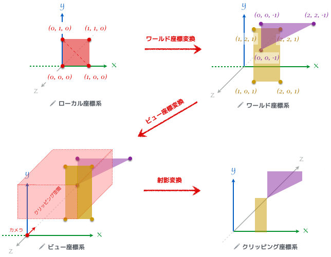

# グラフィックスが世界を描画する仕組み

晴佐久 哲士

---

グラフィックスは現在いろいろなところで使われてます

- ゲーム
- 研究分野
- 医療
- 地図
- 映像

---

今回のLTでは、そんなグラフィックスがどうやって描画されているかを説明します

---

## グラフィックスライブラリ

---

グラフィックスを描画するライブラリもいろいろあります

- OpenGL
- Direct3D
- Vulkan
- Metal

---

OpenGL以外しらないんで、今回はOpenGLで語っていきます

---

グラフィックスってこんな感じに描画行ってますよ

---



---

ざっくりと大別すると

- アプリ(CPUとかメモリ上)側で行う処理
- GPU側で行う処理

で分けることができます

---


## アプリ側での処理


---

### データ準備
- 3次元空間に頂点を設定する
- 頂点にはいろいろな情報が付与されている
    - 3次元空間の座標(XYZ)
    - テクスチャの座標(UV)
    - 色
    - etc
- 平面を作る頂点の組み合わせを定義
    - 平面は点、線、三角形(ポリゴン)で表現
    - 多角形は三角形を組み合わせて表現
- 情報がまとまったらそれをGPUに送る

+++

ちなみに、描画を高速にするのに良くあるのがここの情報をGPUへ送る部分
例えば、三角形を3つ描画するのに3回GPUへ送信するより、3点×3つを一気に渡してあげることで、描画回数を減らし高速化を行ったりします

---

## GPU処理

---
- GPUでどんな計算を行うかはシェーダというGPUで使うプログラムを作成して定義する
- 主なシェーダは2種類
    - バーテックスシェーダ
    - フラグメントシェーダ

+++

### 昔はね…

- 昔はこの辺もC言語の関数を使って簡単に設定することができた
    - `glBegin`とか`glMatrixMode`とか使ってた
- 直感的なんだけど、柔軟性がないってことでこの方法はdeprecateされて今のシェーダを使う方法が推奨されるようになった

---

### バーテックスシェーダ
- バーテックスシェーダは3次元空間の点が画面上のどのピクセルの位置に置かれるのかを計算する
- 変換を行うには、行列を組み合わせていって行う

---

### OpenGLの世界(3D)から実世界(2D)への座標変換

行列をたくさん使って座標の変換をやるよ

---

```

ウィンドウ上の座標 = 射影行列 × ビュー変換行列 × ワールド座標変換行列 × モデル座標

```

---

なんじゃこりゃ

---

1個ずつ説明していきます

---

#### モデル座標(4 × 1)
- 3Dモデルとかの基準点を(0 0 0)としたときの座標
- 3Dモデルは世界の特定の位置に置いてあるので、そこを起点にした頂点座標は世界の座標に変換する必要がある

+++

ここで、XYZの3次元である位置情報を4次元にしているのは座標を変換する方法としてよくあるやり方で、**同次座標系**というものです

+++

例えば、回転と平行移動を行いたいとき同次座標を使わないと

$$P =\left(
\begin{array}{ccc}
cos(rx) & -sin(rx) & 0 \\\\
sin(rx) & cos(rx) & 0 \\\\
0 & 0 & 0
\end{array}
\right) \times \left(
\begin{array}{c}
x \\\\
y \\\\
z \\\\
\end{array}
\right) + \left(
\begin{array}{c}
tx \\\\
ty \\\\
tz \\\\
\end{array}
\right)$$

としなければいけないのが

+++

$$P = \left(
    \begin{array}{cccc}
      cos(rx) & -sin(rx) & 0 & tx \\\\
      sin(rx) & cos(rx) & 0 & ty \\\\
      0 & 0 & 0 & tz \\\\
      0 & 0 & 0 & 1
    \end{array}
  \right) \times \left(
      \begin{array}{c}
        x \\\\
        y \\\\
        z \\\\
        1
      \end{array}
  \right)$$


として掛け算だけで処理できるようになる

---

#### ワールド座標変換行列(4 × 4)
- モデル座標で設定された座標を世界中の座標に変換する行列
- 移動、回転、スケールの組み合わせで構築可能

---

#### ビュー変換行列(4 × 4)
- 視点への座標変換を行う行列
- 必要な視点の情報
    - 視点の位置
    - 視点が見ている位置
    - 視点の上方向(ベクトル)

---

#### 射影行列(4 × 4)
- 視点基準の3D座標から2Dの座標へ変換する行列
- 射影変換にも2種類ある
    - 透視投影変換(奥行きを気にする変換)
    - 平行投影変換(奥行きを無視する変換)
- 変換を行うときに-1 ~ 1の範囲で正規化されるようにクリッピングを行う
---
透視投影変換




---
平行投影



---

これらをすべてシェーダに書くとこんな感じ

---

```glsl

// 座標変換を行うVertexシェーダ

// 入力の3次元空間
attribute vec3 position;

// 変換用の行列
// わかりやすいように分けているが、実際は
// uniform mat4 mvpMatrix;
// のようにまとめるパターンが多い
uniform mat4 modelMatrix;
uniform mat4 viewMatrix;
uniform mat4 projectionMatrix;

void main(void) {
    gl_Position = projectionMatrix * viewMatrix * modelMatrix * position;
}


```
---





---

これで、2次元空間にマッピングできました

---

でも、ディスプレイって-1 ~ 1じゃなく1920 x 1080とかだよね

---

### ビューポート変換とラスタライズ

---

#### ビューポート変換
- 画面のサイズに合わせて-1 ~ 1の空間を実際に描画するディスプレイの座標にマッピングする
- OpenGLでは、`glViewport`で設定できる

---

#### ラスタライズ
- 最終的な位置にピクセルを作成する処理
- ここで生成されたピクセルのことをフラグメントといい、そのフラグメントを処理するシェーダをフラグメントシェーダという

---

#### 簡単なフラグメントシェーダ

```glsl
// 赤色で描画するフラグメントシェーダ

void main() {
    gl_FragColor = vec4(1.0, 0.0, 0.0, 1.0);
}

```

---

ここまでやって、皆さんの見ているディスプレイにグラフィックスが描画されます

---

このあと、テクスチャ(画像)とか影をつけたりとか入るのですが、長くなりそう(というかなってる?)なので今日はここまでにします

---

参考サイト: http://tkengo.github.io/blog/2014/12/20/opengl-es-2-2d-knowledge-0/


---

おわり