# USキーボードの魅力

晴佐久 哲士

---

突然ですが、お手元を確認してみてください

---

当然、プログラマなのであれば

---

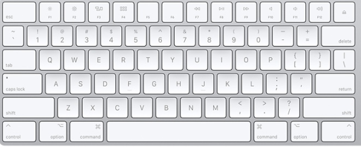

---

ですよねぇ

---

でも、極稀に

---

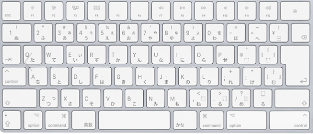

---

な人もいるので、今日はそんな人向けにUSキーボードの魅力を語っていこうと思います

---

## 魅力1. 意味のあるキー配列

---

JISキーボードのキー配列には突っ込みどころがたくさんあります

---

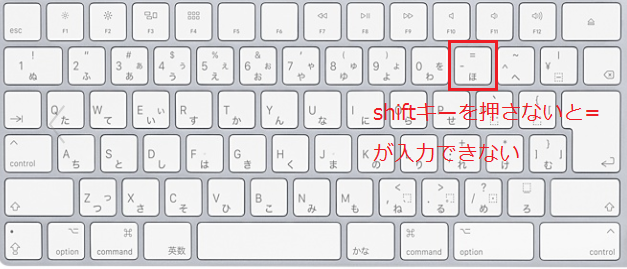

---

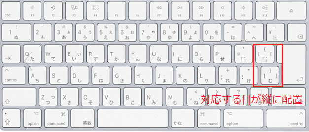

---

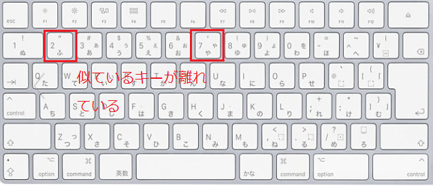

---

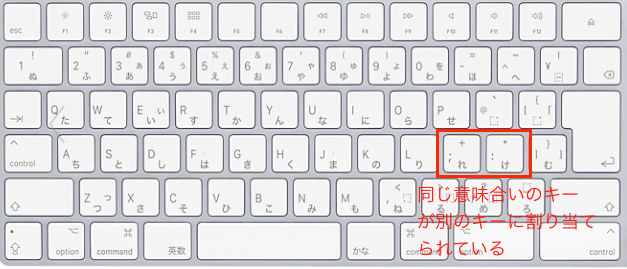

---

一方、US配列だと

---

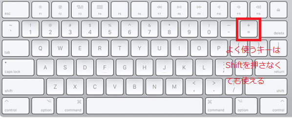

---

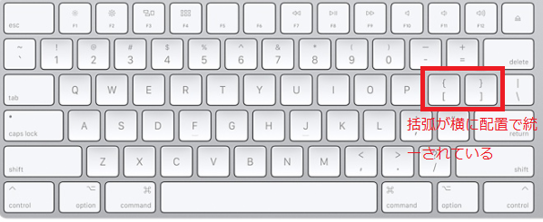

---

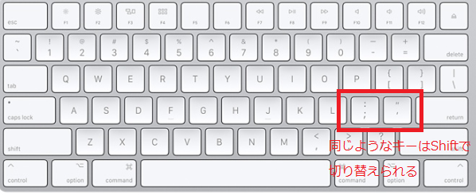

---

といったように配置が合理的です

---

## 魅力2. ホームポジションが意識されたキー配置

---

JISキーボードをお使いの方は、ホームポジションに手を添えてみてください

---

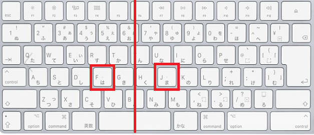

---

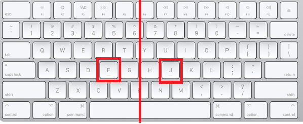

---

ん？

---

---

---

JISキーボードだと、センターがやや左寄りになっています

---

USキーボードだと、センターに合わせてあるため、よく使うreturnキーまで小指が届き、いちいちホームポジションから指を離さないで作業ができます

---

## 魅力3. 合理的なキーサイズ

---

JIS配列の突っ込みどころはまだまだあります

---

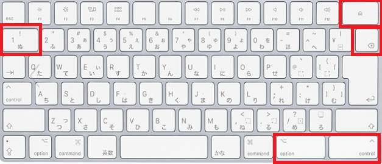

---

なんで、こんなにキーの大きさバラバラなの・・・

---

Delキーなんてよくつかうじゃん！

---

一方のUSキーボードだと

---

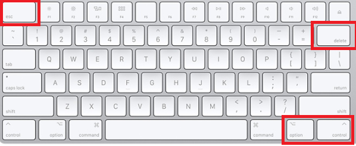

---

必要なキーが必要な大きさになっています

---

